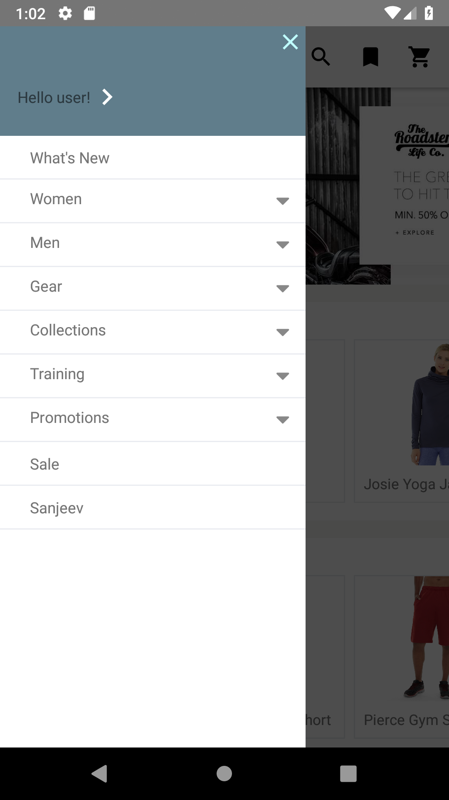
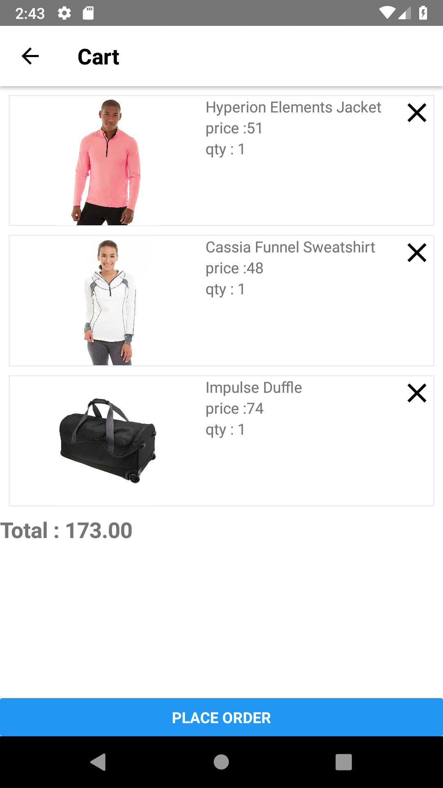

  <b>MAGECART IS CURRENTLY IN EARLY DEVELOPMENT, NOT READY TO BE USED!</b>

# MageCart : Magento 2 React Native eCommerce App

 

MageCart is an e-commerce app for Magento 2.1 onwards. It consumes [Magento 2 REST API](https://devdocs.magento.com/guides/v2.3/get-started/rest_front.html) to display catalog, products, add products to cart and let you place order.

## :camera: Screenshots

  
  
  
  
  

## :rocket: Getting Started

Follow this [Documentaion](https://github.com/alexakasanjeev/magento_react_native/wiki/Setup) for detail step by step instructions on how to setup project locally and run the project.

## 🤝 Contributing  

Finding bugs, sending pull requests or improving docs - any contribution is welcome and highly appreciated. To get started, head over to our [contribution guidelines](CONTRIBUTING.md). Thanks!

## :man: Authors

* **Sanjeev Yadav** - *Initial work* - [alexakasanjeev](https://github.com/alexakasanjeev)

See also the list of [contributors](https://github.com/alexakasanjeev/magento_react_native/contributors) who participated in this project.

## :page_facing_up: License

This project is licensed under the GNU v3 Public License License - see the [LICENSE.md](LICENSE.md) file for details.

## :bulb: Acknowledgements

* [troublediehard/magento-react-native](https://github.com/troublediehard/magento-react-native) created by [Dmytro Portenko](https://github.com/troublediehard)
* [README-Template.md](https://gist.github.com/PurpleBooth/109311bb0361f32d87a2) by [Billie Thompson](https://github.com/PurpleBooth)
